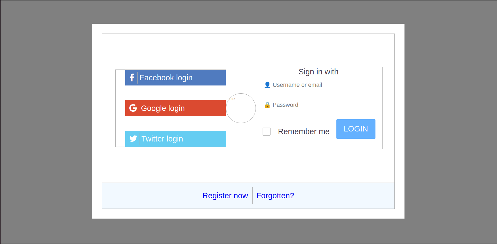

# Login SCSS

**[Test this app yourself](https://vincenzoarena.github.io/login-scss/)**

---

### About Project

An exercise on how to build a login page. 

### How to use this Project

The page has no working functionalities.

##### Developed With

- [x] _HTML5_
- [ ] _CSS3_
- [ ] _SASS_
- [x] _SCSS_
- [ ] _JavaScript_
- [ ] _React_
- [ ] _Bootstrap_
- [x] _npm_
- [ ] _..._

---

### Contact

Mail: <penninoematita@gmail.com> 
GitHub: [vincenzoarena](https://github.com/vincenzoarena) 
LinkedIn: [Vincenzo Arena](https://www.linkedin.com/in/vincenzo-arena-032a064b/)

---

### Used Tools

- [Fibt Awesome icons](https://fontawesome.com/)
- [npm](https://www.npmjs.com/)
- [Google Fonts](https://fonts.google.com/)
- [Visual Studio Code](https://code.visualstudio.com/)

---
